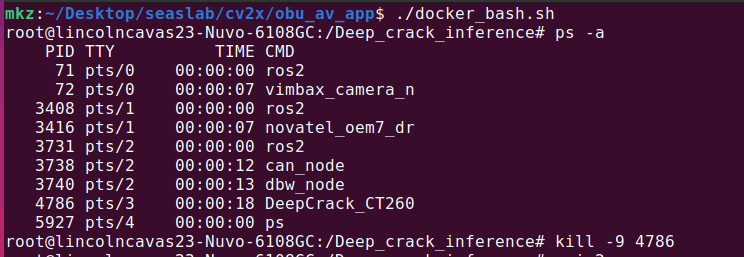

# Applications for Connected Autonomous Vehicle with OBU

This folder contains CV2X-based applications that can run on the Lincoln MKZ platform

## Required by all applications

Python 3.10 \
ROS2 humble \
Commsignia APIs (need license)

## RTK GPS

See [RTK GPS](RTK_GPS/README.md) for details on how to set up the RTK GPS.

## CV2X based car-following

See [CV2X based car-following](CV2X_Car_Following/README.md) for details on how to set up the CV2X-based car-following application.

## CV2X based crack-detection

TODO: to be finalized by @harshbhargava123

Step to run the crack-detection application on Lincoln MKZ platform:
1. check this repo as it is to the Lincoln MKZ platform
2. run `docker_run_lincoln.sh` to start the docker container. 
   ```bash
   ./docker_run_lincoln.sh
   ```
   This will start a Docker container with the necessary environment for running the crack-detection application. The launched container will have the name `cv2x`.

3. Open another terminal, type `docker ps` you should see the docker container running. 
Then run the bash command to enter the container:
   ```bash
   docker exec -it cv2x /bin/bash
   ```
   [docker_bash.sh](docker_bash.sh) is a script that can be used to enter the Docker container.
   You can also use the command above directly in the terminal.
   Both of these steps will give you a shell terminal inside the Docker container.

4. Launch three shell terminal to the same Docker container, and run the following commands in each terminal to launch ROS2 environment:

   ```bash
    # DBW:
    ros2 launch ds_dbw_can dbw.launch.xml

    # Novatel GPS:
    ros2 launch novatel_oem7_driver oem7_net.launch.py oem7_ip_addr:=192.168.100.201 oem7_port:=3005

    # Mako Camera:
    ros2 run vimbax_camera vimbax_camera_node
   ```
    These commands will start the necessary ROS2 nodes for the crack-detection application, including the DBW (Drive-by-Wire) system, Novatel GPS, and Mako Camera. They are a selected subset of the nodes. Full list of nodes can be found at [ub-cavas](https://github.com/ub-cavas/ub-lincoln-docker?tab=readme-ov-file#in-container-commands).

5. In another shell terminal inside the docker, run the following command to start the crack-detection application:
   ```bash
   python3 cv2x_crack_detection.py
   ```

## Troubleshooting Tips

Remark 1: Due to multi-threading, the crack-detection application may not terminate properly and it appears hanging. 
.

You may need to kill the process manually by running:
```bash
# start a bash shell in the docker container
docker_bash.sh 
# list all processes, find the process ID (PID) of the crack-detection application
ps -ax 
# replace <PID> with the process ID of the crack-detection application, -9 gives elevated privilege to kill the process
kill -9 <PID> 
```
Example:



Remark 2: Docker container contains ROS2 and with camera connected it should be able to launch GUI applications such as Rviz. 
However, sometimes you may encounter the following error when trying to run a GUI application inside the docker container:

```
Authorization required, but no authorization protocol specified
qt.qpa.xcb: could not connect to display :1
qt.qpa.plugin: Could not load the Qt platform plugin "xcb" in "" even though it was found.
This application failed to start because no Qt platform plugin could be initialized. Reinstalling the application may fix this problem.

Available platform plugins are: eglfs, linuxfb, minimal, minimalegl, offscreen, vnc, xcb.

Aborted (core dumped)
```

This can be resolved by adding the following tag when launching the docker container:
```
 -v ${XAUTHORITY:-$HOME/.Xauthority}:/root/.Xauthority \
```
see [docker_run_lincoln.sh](docker_run_lincoln.sh) for details.
