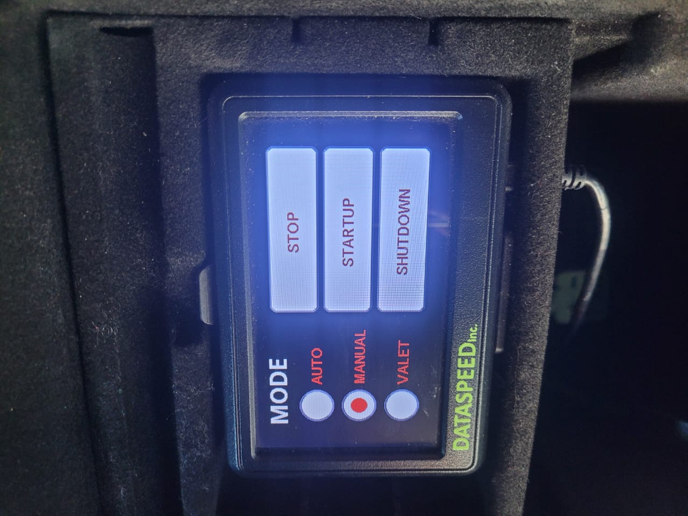
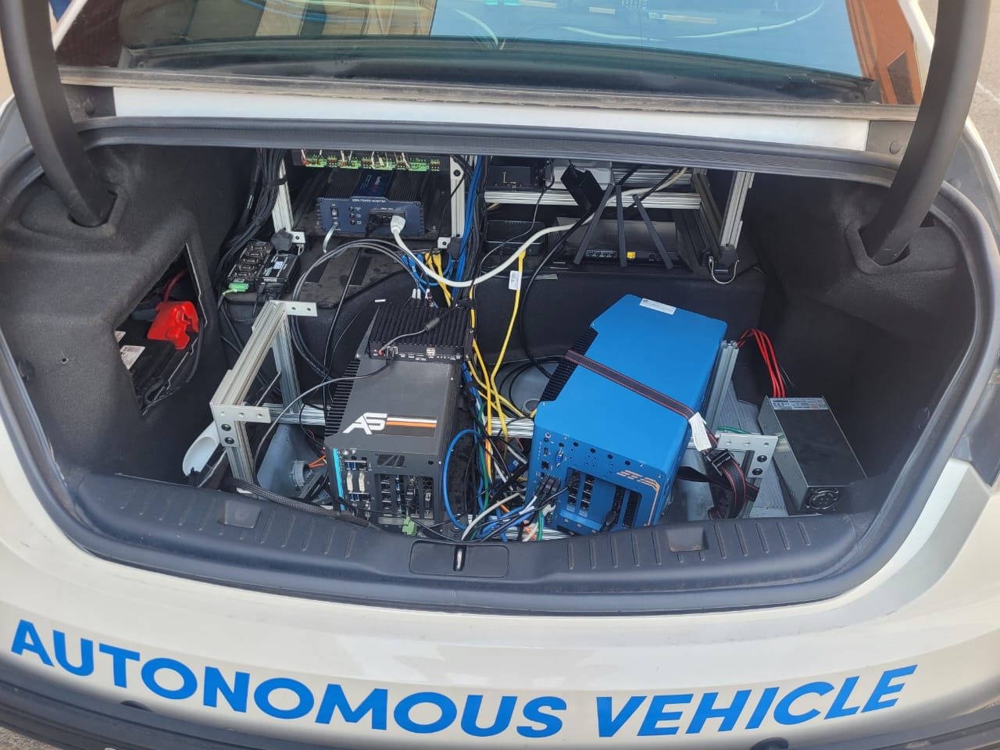
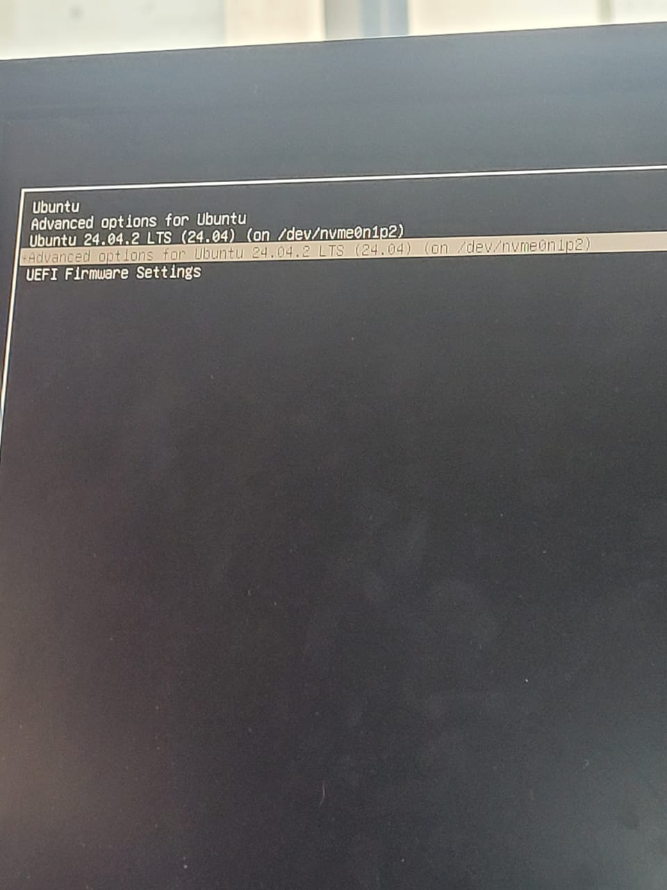
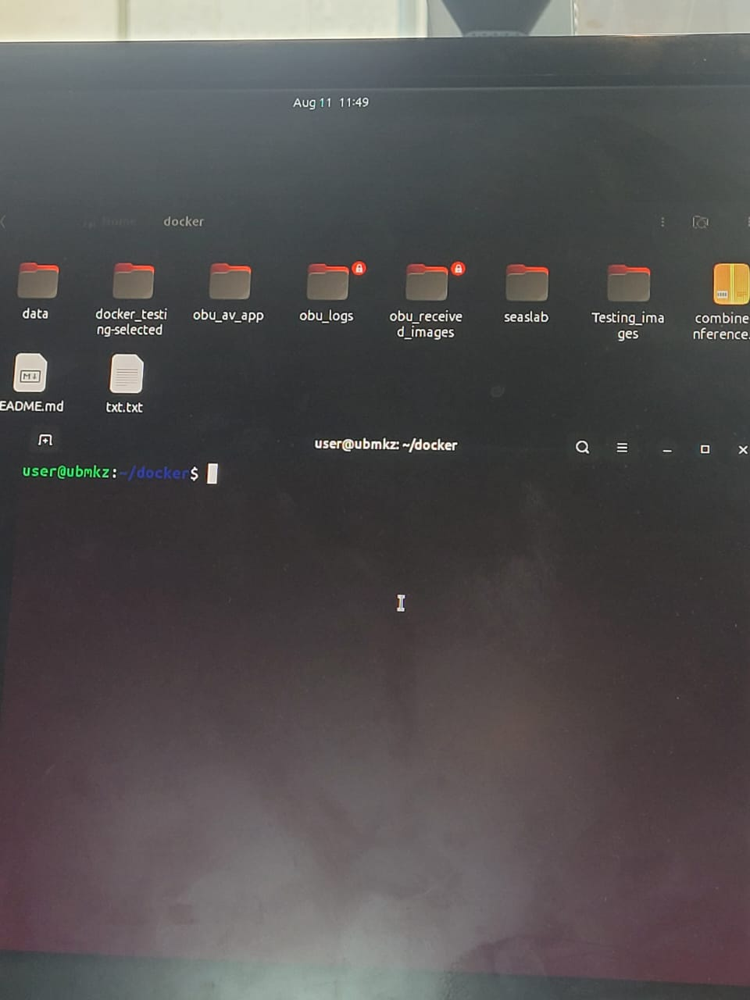
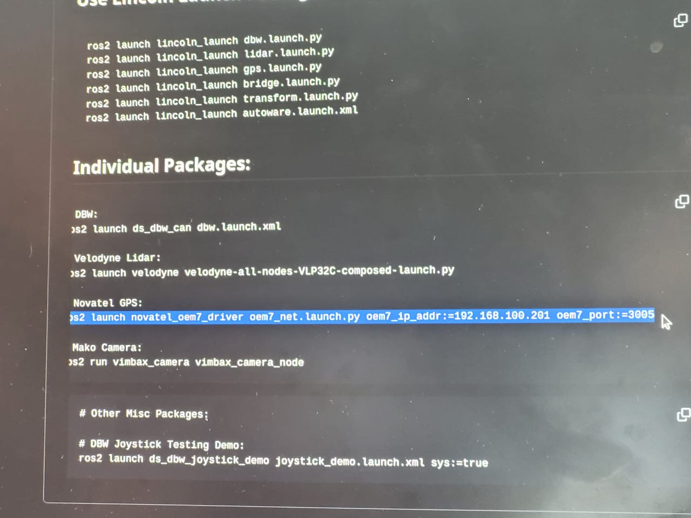
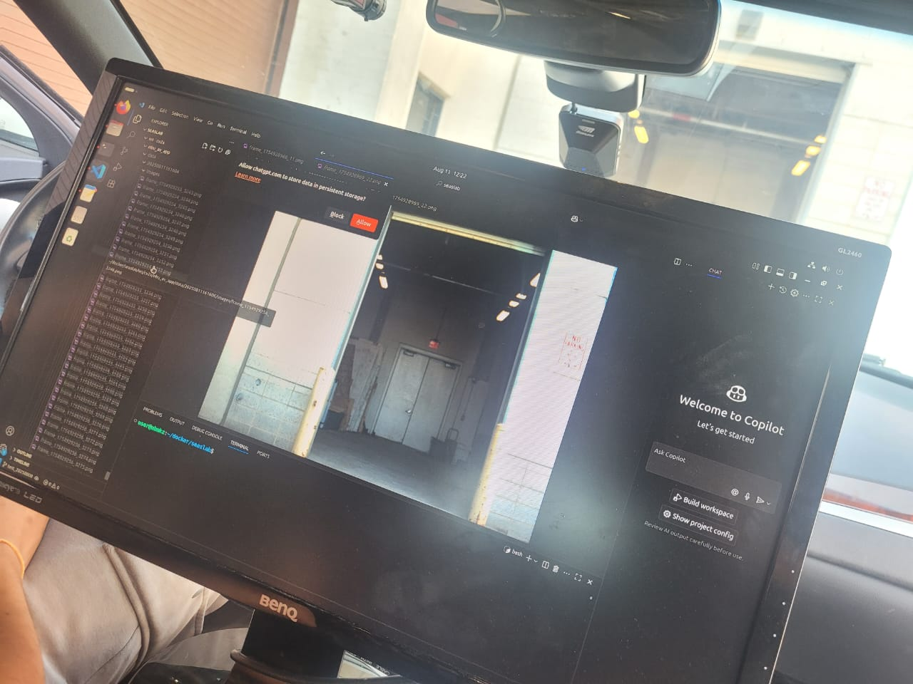

# Lincoln AV — Crack Detection System Startup Guide

This file walks you through powering up the vehicle compute stack and starting the crack‑detection pipeline.
> **Flow:** Power‑up → Boot Ubuntu → Start Docker workspace → Launch ROS 2 nodes (DBW, NovAtel GPS, Mako Camera) → Run crack detection → Verify images are saved → Safe shutdown.


## 0) Preconditions

- Vehicle parked inside the garage and the front exactly at the X mark drawn on ground.


## 1) Power up the car computer stack

1. **Switch the knob** to power the system. Then on the **Dataspeed panel** tap **STARTUP** and wait; the indicators below will turn **green** when each subsystem is ready.  
   

2. In the trunk, **turn on the inverter** and the **CPU/computers**. 
   

---

## 2) Boot into Ubuntu 24.04

1. Power on the monitor. At the boot menu (GRUB), select **Ubuntu 24.04 LTS**.  
   

2. Log in to the desktop.

---

## 3) Open the workspace in the Docker container

A helper script to run the NVIDIA‑enabled Docker container that mounts the workspace at `/ws` and shows display access.

1. Open **Terminal** and go to the docker folder in your home directory:
   ```bash
   cd ~/docker
   ls
   ```
   folders like `seaslab`, `obu_av_app`, `obu_received_images`, etc are visible.
   

2. (One time) Make the launcher executable:
   ```bash
   chmod +x docker_run_lincoln.sh
   ```

3. **Start the Docker container** by running the launcher script:
   ```bash
   ./docker_run_lincoln.sh
## 4) Launch the required ROS 2 nodes (3 terminals)


### A) DBW
```bash
ros2 launch ds_dbw_can dbw.launch.xml
```

### B) NovAtel GPS
```bash
ros2 launch novatel_oem7_driver oem7_net.launch.py   oem7_ip_addr:=192.168.100.201 oem7_port:=3005
```


### C) Mako Camera
```bash
ros2 run vimbax_camera vimbax_camera_node
```

## 5) Run the crack‑detection script

1. Open another terminal **inside the container** and navigate to:
   ```bash
   cd /ws/cv2x/obu_av_app
   ls
   ```

2. Start the detector:
   ```bash
   bash run_crack_detection.sh
   # or
   python3 crack_detection.py --config config.yaml
   ```

3. When running, you should see live frames or logs.  
   

---

## 6) Where images are saved

Captured images are written under a date‑stamped folder, e.g.:
```
~/docker/images/2025-08-11_*
```

## 7) Shutdown procedure

1. **Stop the crack detector** (Ctrl‑C).  
2. **Ctrl‑C** each ROS 2 node terminal (DBW, GPS, Camera).  
3. Exit the container: type `exit`.
4. From the Dataspeed panel tap **STOP**, then **SHUTDOWN**.  
5. Power off the monitor and then the **CPU/inverter** in the trunk.


## File Map (for reference)

```
~/docker/
├── docker_run_lincoln.sh        # Starts the container (edit tag if image updates)
├── seaslab/ws/                  # Mounted into container at /ws
│   └── cv2x/obu_av_app/         # Crack‑detection application
├── images/                      # Date‑stamped image dumps
```

---
