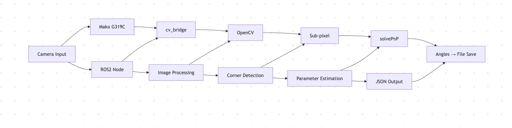
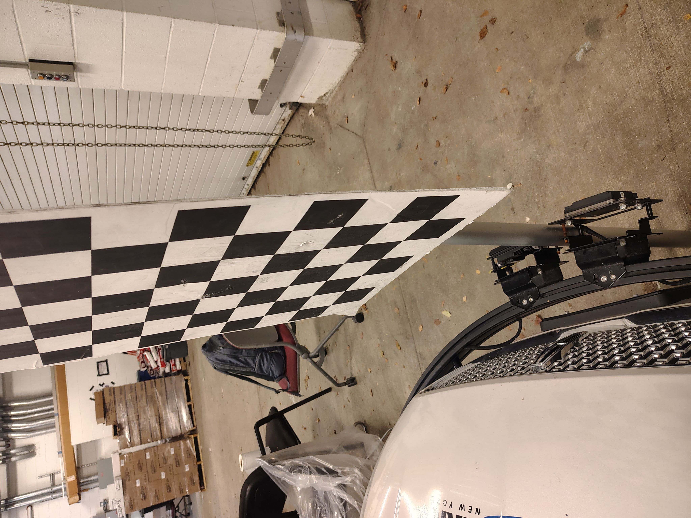
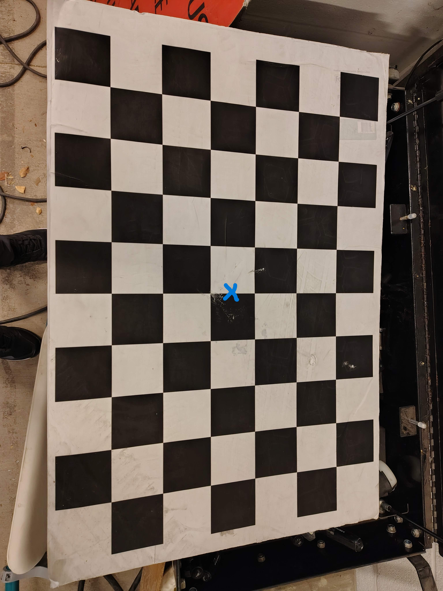
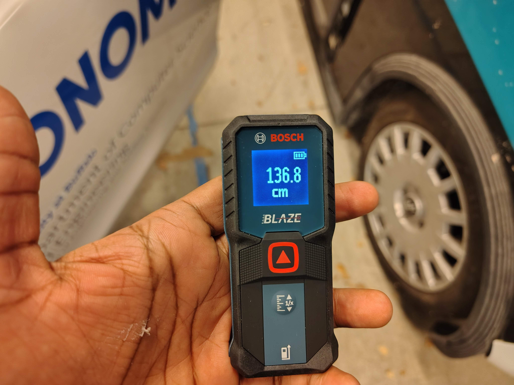
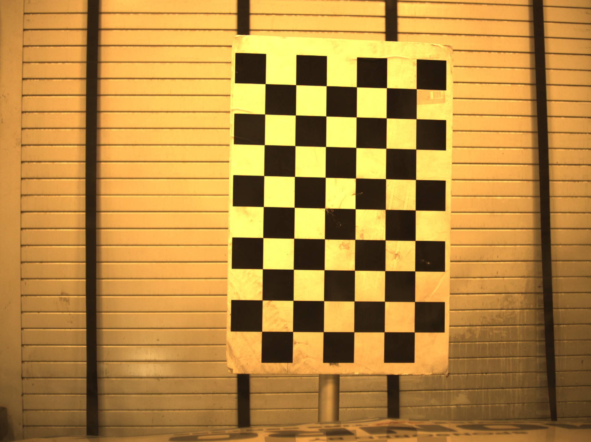

# Mako G319 Camera Calibration System

## Project Overview

This project implements a camera calibration system for the **Allied Vision Mako G319C** camera using the **ROS2 framework**.
It provides **dual-mode calibration** with automated extrinsic parameter estimation using checkerboard pattern detection.

## Key Features

* **Dual-Mode Calibration**: Full calibration or JSON-based intrinsics
* **ROS2 Integration**: Seamless integration with robotics/vehicle systems
* **Automated Extrinsic Estimation**: Single-image pose recovery using a known checkerboard pattern

## System Architecture



---

## Checkerboard Setup for Vehicle-Based Calibration

### 1. Checkerboard Positioned in Front of the Vehicle



### 2. Top View with Center Marked



### 3. Checkerboard Center Height from Ground
- The updated measured height of the checkerboard center from ground level is 136.8 cm.



### 4. Image Captured from Vehicle Camera (Used for Calibration)



---

## Implementation Workflow

### Mode 1: Full Calibration

1. **Image Capture**
2. **Corner Detection** (OpenCV)
3. **Intrinsic Parameter Estimation** (Zhang’s Method)
4. **Reprojection Validation**

### Mode 2: JSON Intrinsics (Used in This Experiment)

1. Load intrinsics from JSON
2. Capture single image
3. Compute extrinsics
4. Export parameters

---

## Architecture

| Module                   | Technology         | Function                   |
| ------------------------ | ------------------ | -------------------------- |
| **ROS2 Node**            | rclpy, sensor_msgs | Camera data acquisition    |
| **Image Processing**     | OpenCV, cv_bridge  | Checkerboard detection     |
| **Parameter Estimation** | scipy, numpy       | Extrinsic computation      |
| **Data Handling**        | JSON serialization | Saving calibration results |

---

## Updated Experimental Results (On-Vehicle Test)

### Loaded Camera Intrinsics (from JSON)

```
[[3.40617511e+03 0.00000000e+00 1.08042986e+03]
 [0.00000000e+00 3.42322324e+03 7.85284572e+02]
 [0.00000000e+00 0.00000000e+00 1.00000000e+00]]
```

### Extrinsic Matrix (Transformed Coordinate Frame)

```
[[ 1.05928293e-01 -4.89749104e-02  9.93166982e-01  2.20798581e+02]
 [-9.94206128e-01  1.31232135e-02  1.06686255e-01  9.89094138e+00]
 [-1.82584922e-02 -9.98713793e-01 -4.73010365e-02  3.17463254e+01]]
```

### Orientation (Euler Angles)

* **Yaw**: −6.09°
* **Pitch**: −2.81°
* **Roll**: 0.75°

These values are saved in `mako_parameters_updated.json`.

---

## On-Vehicle Test Procedure

1. **Turn on the vehicle**
2. **Enter the Docker container**
3. **Launch the camera node**

   ```bash
   ros2 launch vimbax_camera vimbax_camera_node.launch.py
   ```
4. **Place the checkerboard in front of the vehicle** as shown in the setup images
5. **Run the calibration script**

   ```bash
   python3 calibration_mako_ros2_updated_axes.py
   ```
6. The system will:

   * Load intrinsics
   * Capture one checkerboard image
   * Compute translation (X,Y,Z)
   * Compute yaw, pitch, roll
   * Save all parameters

---

## Code Structure

```
calibration_mako_ros2_updated_axes.py
├── Configuration Parameters
├── ROS2 Camera Node Class
├── Checkerboard Detection Functions
├── Intrinsic / Extrinsic Estimation
└── Parameter Export & Validation
```

### Key Functions

* `CameraNode`: ROS2 subscriber
* `find_corners()`: Checkerboard corner detection
* `capture_checkerboard_image()`: Automated capture
* `solvePnP`-based extrinsic estimation
* JSON export of R, t, yaw, pitch, roll

---

## Installation & Usage

### Prerequisites

```bash
sudo apt install ros-humble-desktop ros-humble-cv-bridge ros-humble-vimbax-camera
pip3 install opencv-python numpy scipy
```

### Running Calibration

```bash
ros2 launch vimbax_camera vimbax_camera_node.launch.py
python3 calibration_mako_ros2.py
```

---

## Configuration Options

| Parameter            | Description        | Default                        |
| -------------------- | ------------------ | ------------------------------ |
| **MODE**             | Calibration type   | `json_intrinsics`              |
| **CHECKERBOARD**     | Pattern dimensions | `(6, 9)`                       |
| **square_size**      | Square size (cm)   | `6.95`                         |
| **INTRINSICS_FILE**  | Intrinsics input   | `camera.json`                  |
| **SAVE_PARAMS_FILE** | Calibration output | `mako_parameters_updated.json` |

---

## Generated Output Files

* `checkerboard_capture.jpg` – Vehicle camera capture
* `extrinsic_image.jpg` – Final processed image
* `mako_parameters_updated.json` – Full calibration output (matrix + Euler angles)